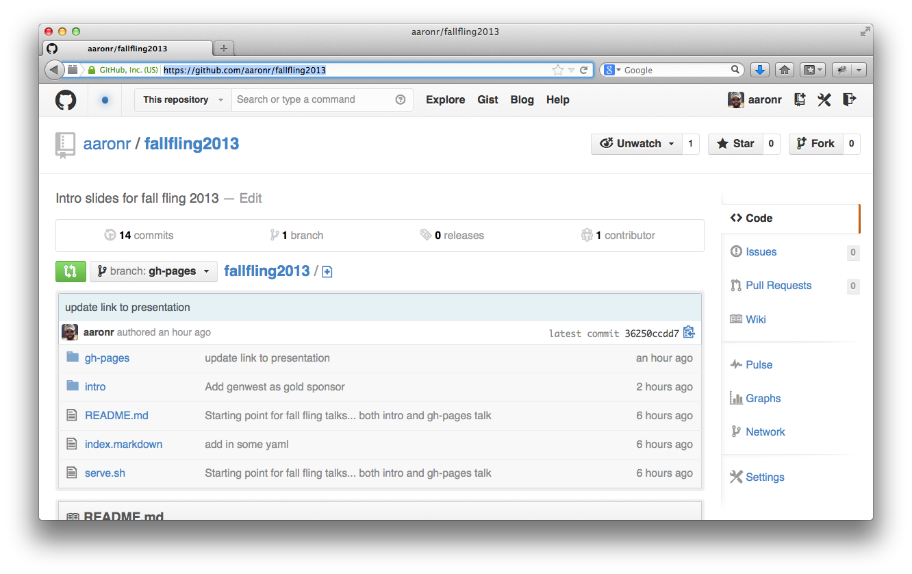
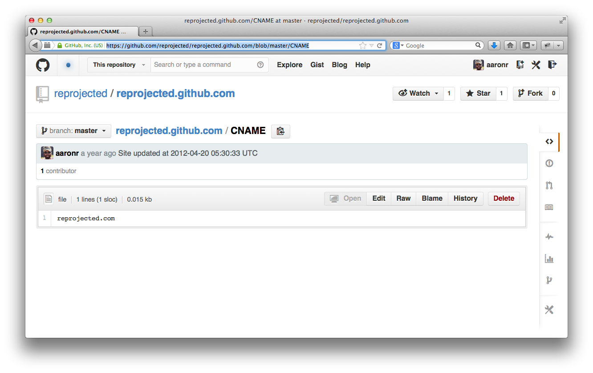

<!------------------------------------------------------------>
<!-- Topic: Intro Slide -->

<h2>Leveraging GitHub Pages</h2>
<h3>for maps... and other things</h3>

  <small>Aaron Racicot - <a href="mailto:aaronr@z-pulley.com">aaronr@z-pulley.com</a>
   
  <a href="http://reprojected.com">reprojected.com</a> / <a href="http://twitter.com/reprojected">@reprojected</a> / <a href="https://github.com/aaronr">github.com/aaronr</a>
    
  <a href="http://aaronr.github.io/fallfling2013/intro/">aaronr.github.io/fallfling2013/gh-pages</a>
</small>

<!------------------------------------------------------------>
--SLIDE--
<!-- Topic: What is it... -->

<!------------------------------------------------------------>
--SLIDE--
<!-- Topic: Scenarios -->

<h2>Scenarios</h2>
 
<ul>
  <li style="list-style-type: none;"><strong></strong>User/Organization Pages</li>
  <li style="list-style-type: none;"><strong></strong>Project Pages</li>
  <li style="list-style-type: none;"><strong></strong>Using CNAME</li>
  <li style="list-style-type: none;"><strong></strong>Jekyll/Markdown</li>
  <li style="list-style-type: none;"><strong></strong>Editing tools</li>
  <li style="list-style-type: none;"><strong></strong>Example... cugos.org</li>
  

  <li style="list-style-type: none;"><strong></strong>Raw GeoJSON in repo</li>
  <li style="list-style-type: none;"><strong></strong>Raw GeoJSON in gists</li>
  <li style="list-style-type: none;"><strong></strong>geojson.io</li>
  <li style="list-style-type: none;"><strong></strong>Map frameworks in gh-pages</li>
  <li style="list-style-type: none;"><strong></strong>Putting it all together... simple example... CUGOS User Map</li>
</ul>

<!------------------------------------------------------------>
--SLIDE--
<!-- Topic: User/Org pages -->

<h2>User/Organization Pages</h2>

<a href="https://help.github.com/articles/user-organization-and-project-pages">user-organization-and-project-pages</a>

--SUBSLIDE--

<h2>Create a repo</h2>
 
<ul>
  <li style="list-style-type: none;"><strong>name.github.io</strong></li>
  <li style="list-style-type: none;"><strong>Use master branch</strong></li>
  <li style="list-style-type: none;"><strong>Wait 10 minutes</strong></li>
  <li style="list-style-type: none;"><strong>Visit name.github.io</strong></li>
</ul>

--SUBSLIDE--

--SUBSLIDE--

--SUBSLIDE--

<!------------------------------------------------------------>
--SLIDE--
<!-- Topic: Project pages -->

<h2>Project Pages</h2>

--SUBSLIDE--

<h2>Create a repo</h2>
 
<ul>
  <li style="list-style-type: none;"><strong>reponame</strong></li>
  <li style="list-style-type: none;"><strong>Create gh-pages branch</strong></li>
  <li style="list-style-type: none;"><strong>Wait 10 minutes</strong></li>
  <li style="list-style-type: none;"><strong>Visit name.github.io/reponame</strong></li>
</ul>

--SUBSLIDE--

--SUBSLIDE--

<!------------------------------------------------------------>
--SLIDE--
<!-- Topic: CNAME -->

<h2>CNAME</h2>
<a href="https://help.github.com/articles/setting-up-a-custom-domain-with-pages">setting-up-a-custom-domain-with-pages</a>

--SUBSLIDE--

<h2>Create a repo</h2>
 
<ul>
  <li style="list-style-type: none;"><strong>Create CNAME file in repo</strong></li>
  <li style="list-style-type: none;"><strong>Add URL to CNAME file... reprojected.com </strong></li>
  <li style="list-style-type: none;"><strong>A record pointing to 204.232.175.78</strong></li>
  <li style="list-style-type: none;"><strong>Wait for DNS to propogate</strong></li>
  <li style="list-style-type: none;"><strong>Visit your site</strong></li>
</ul>

--SUBSLIDE--

--SUBSLIDE--

--SUBSLIDE--

<h2>Remember custom 404.html</h2>

<!------------------------------------------------------------>
--SLIDE--
<!-- Topic: Jekyll/Markdown -->

<h2>Jekyll/Markdown</h2>

<a href="https://help.github.com/articles/using-jekyll-with-pages">using-jekyll-with-pages</a>
<a href="http://daringfireball.net/projects/markdown/syntax">markdown</a>

--SUBSLIDE--

--SUBSLIDE--

<!------------------------------------------------------------>
--SLIDE--
<!-- Topic: Editing Tools -->

<h2>Editing Tools</h2>

<a href="http://prose.io">prose.io</a>

--SUBSLIDE--

<!------------------------------------------------------------>
--SLIDE--
<!-- Topic: cugos.org -->

<h2>cugos.org</h2>

<a href="https://github.com/cugos/cugos.github.com">https://github.com/cugos/cugos.github.com</a>

--SUBSLIDE--

<!------------------------------------------------------------>
--SLIDE--
<!-- Topic: Raw GoeJSON in repo -->

<h2>Raw GeoJSON in Repo</h2>

--SUBSLIDE--

<!------------------------------------------------------------>
--SLIDE--
<!-- Topic: GeoJSON in gist -->

<h2>Raw GeoJSON in Gist</h2>

--SUBSLIDE--

--SUBSLIDE--

--SUBSLIDE--

<h2>Embed</h2>
    
    

<!------------------------------------------------------------>
--SLIDE--
<!-- Topic: geojson.io -->

<h2>geojson.io</h2>

--SUBSLIDE--

<!------------------------------------------------------------>
--SLIDE--
<!-- Topic: Map frameworks in gh-pages -->

<h2>Maps in GitHub Pages</h2>
 

 
<h2>It is just HTML/CSS/JS</h2>

--SUBSLIDE--

<h2>They all work...</h2>

<!------------------------------------------------------------>
--SLIDE--
<!-- Topic: putting it all together... user map -->

<h2 style="color:red;">Hack Alert</h2>
 

 
<h2>CUGOS User Map</h2>

--SUBSLIDE--

<h2>Tools</h2>
<ul>
  <li style="list-style-type: none;"><strong>GitHub Pages (hosting)</strong></li>
  <li style="list-style-type: none;"><strong>GeoJSON (data store)</strong></li>
  <li style="list-style-type: none;"><strong>Leaflet (web map)</strong></li>
  <li style="list-style-type: none;"><strong>Mapbox (base map)</strong></li>
  <li style="list-style-type: none;"><strong>geojson.io (editing)</strong></li>
</ul>

--SUBSLIDE--

<!------------------------------------------------------------>
--SLIDE--
<!-- Topic: Wrapup -->

<h2>Wrap-up</h2>

<ul>
  <li style="list-style-type: none;"><strong></strong>GitHub Pages is FUNCTIONAL</li>
  <li style="list-style-type: none;"><strong></strong>GitHub Pages is FUN</li>
  <li style="list-style-type: none;"><strong></strong>GitHub Pages is FREE</li>
</ul>

<h2>Use It!</h2>

<!------------------------------------------------------------>
--SLIDE--
<!-- Topic: Finish -->

<h2>Thanks</h2>

