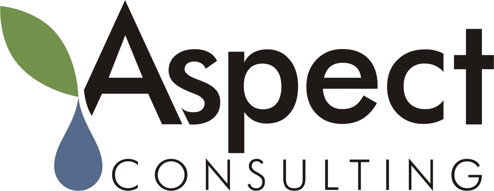
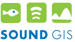
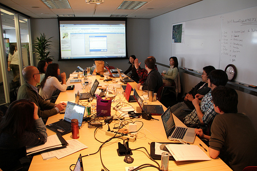
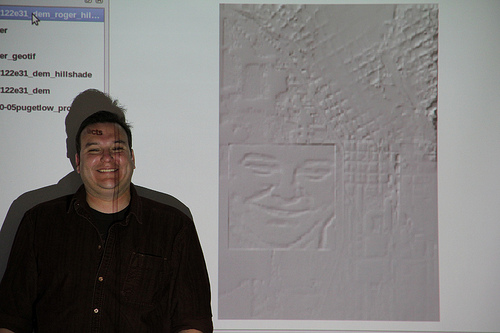

<!------------------------------------------------------------>
<!-- Topic: Welcome -->

<h2><b>CUGOS Fall Fling 2013</b></h2>

<h3>Welcome</h3>

  <small>Aaron Racicot - <a href="mailto:aaronr@z-pulley.com">aaronr@z-pulley.com</a>
   
  <a href="http://reprojected.com">reprojected.com</a> / <a href="http://twitter.com/reprojected">@reprojected</a> / <a href="https://github.com/aaronr">github.com/aaronr</a>
    
  <a href="http://aaronr.github.io/fallfling2013/intro/">aaronr.github.io/fallfling2013/intro</a>
</small>

<!------------------------------------------------------------>
--SLIDE--
<!-- Topic: Place -->

<h1>Thanks <b>UW</b></h1>
Huge thanks to Matt Dunbar and Monika Moskal

<!------------------------------------------------------------>
--SLIDE--
<!-- Topic: Sponsors -->

<h2>Sponsors</h2>
<h1 style="color:gold;">GOLD</h1>

--SUBSLIDE--

<h2>LizardTech</h2>

--SUBSLIDE--

<h2>SpatialDev</h2>

--SUBSLIDE--

<h2>Point Inside</h2>

<!------------------------------------------------------------>
--SLIDE--
<!-- Topic: Sponsors -->

<h2>Sponsors</h2>
<h1 style="color:silver;">SILVER</h1>

--SUBSLIDE--

<h3>TerraGIS</h3>
 
 

<h3>Tableau</h3>

--SUBSLIDE--

<h3>Aspect Consulting</h3>
 
 

<h3>Situated Labs</h3>

--SUBSLIDE--

<h3>ERMA</h3>
 
 

<h3>SoundGIS</h3>

<!------------------------------------------------------------>
--SLIDE--
<!-- Topic: What is CUGOS -->

<h2><b>CUGOS ?!?!</b></h2>

<h3><b>C</b>ascadia <b>U</b>sers of <b>G</b>eospatial <b>O</b>pen <b>S</b>ource</h3>

--SUBSLIDE--

<h2>501(c)6 Non-Profit</h2>

> 501(c)(6) organization - Organizations include Business Leagues, Home Builders Association, the Security Industry Association, Chambers of Commerce, Real Estate Boards, etc. such as the U.S. Chamber of Commerce, the Edison Electric Institute, and the National Football League.

--SUBSLIDE--

<h2>Monthly Meetings</h2>

<h3>Third Wednesday of the month</h3>

--SUBSLIDE--

<h2>Great fun!</h2>

<!------------------------------------------------------------>
--SLIDE--
<!-- Topic: General Schedule -->

<h2>Morning Keynote</h2>
 
<ul>
  <li style="list-style-type: none;"><strong>Replacing ArcGIS Server with NodeJS and PostGIS</strong></li>
  <li style="list-style-type: none;">Ryan Whitley, Software Developer, SpatialDev</li>
</ul>

--SUBSLIDE--

<h2>Morning Talks</h2>
 
<ul>
  <li style="list-style-type: none;"><strong>Touring the GINA Zoo -- Big Data, Web Apps, Lions</strong></li>
  <li style="list-style-type: none;">Will Fisher, GINA Alaska </li>
  

  <li style="list-style-type: none;"><strong>Big Data Worship -- Aerial Structure from Motion Surveys and Antarctica/Greenland DEMs</strong></li>
  <li style="list-style-type: none;">David Shean, UW Dept of Earth and Space Sciences</li> 
  

  <li style="list-style-type: none;"><strong>Geoserver Shell -- Manage GeoServer using a CLI</strong></li>
  <li style="list-style-type: none;">Jared Erickson, Pierce County Developer</li>
</ul>

--SUBSLIDE--

<h2>Morning Talks (cont.)</h2>
 
<ul>
  <li style="list-style-type: none;"><strong>WebGIS for Decision Support -- Problem Solving with OpenSource GIS</strong></li>
  <li style="list-style-type: none;">Karsten Vennemann, Terra GIS Ltd </li>
  

  <li style="list-style-type: none;"><strong>Empower ENGINE</strong></li>
  <li style="list-style-type: none;">Julie and Noah, EmpowerENGINE.com </li>
  

  <li style="list-style-type: none;"><strong>Easy Maps with GitHub and GitHub Pages</strong></li>
  <li style="list-style-type: none;">Aaron Racicot, Hacker </li>
</ul>

--SUBSLIDE--

<h2>Lunch - Q/A</h2>

--SUBSLIDE--

<h2>Lightening talks</h2>
 
<ul>
  <li style="list-style-type: none;"><strong>paxdb: Graph Queries via Leaflet Map</strong></li>
  <li style="list-style-type: none;">James "keppy" Dominguez, Hacker</li>
  

  <li style="list-style-type: none;"><strong>D3.geo</strong></li>
  <li style="list-style-type: none;">Sam Matthews, Founder, Situated Labs</li>
  

  <li style="list-style-type: none;"><strong>Raster Edge Detection</strong></li>
  <li style="list-style-type: none;">Andrew Powers, Point Inside</li>
</ul>

--SUBSLIDE--

<h2>Lightening talks (cont.)</h2>
 
<ul>
  <li style="list-style-type: none;"><strong>Data Visualization of Urban Systems with GeoServer & Google Earth - Decisions for DRiVE</strong></li>
  <li style="list-style-type: none;">Luis F. Borrero, DRiVE</li>
  

  <li style="list-style-type: none;"><strong>TileStache</strong></li>
  <li style="list-style-type: none;">Matt Kenny, GIS Data Engineer Tableau Software</li>
</ul>

--SUBSLIDE--

<h2>Workshop/Hack</h2>
<ul>
  <li style="list-style-type: none;"><strong>Learn How to Edit OpenStreetMap to Add Your Favorite Hangout</strong></li>
  <li style="list-style-type: none;">Clifford Snow and Chase Stephens, OSM Seattle CEO(s)</li>
  

  <li style="list-style-type: none;"><strong>The Python GDAL/OGR Cookbook Sessions</strong></li>
  <li style="list-style-type: none;">Cort Daniel, Michael Payne, Greg Corradini</li>
</ul>

<!------------------------------------------------------------>
--SLIDE--
<!-- Topic: Have Fun! -->

<h1>Have FUN!</h1>
<a href="http://cugos.org">cugos.org</a>
