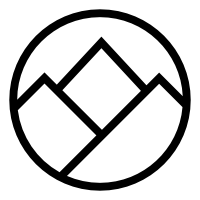

<!------------------------------------------------------------>
<!-- Topic: Welcome -->

<h2><b>CUGOS Fall Fling 2013</b></h2>

<h3>Welcome</h3>

<!------------------------------------------------------------>
--SLIDE--
<!-- Topic: Place -->

<h1>UW comes through again!</h1>

Huge thanks to Matt Dunbar and Monika Moskal

<!------------------------------------------------------------>
--SLIDE--
<!-- Topic: Sponsors -->

<h1>Sponsors - GOLD!</h1>

--SUBSLIDE--

<h2>LizardTech</h2>

--SUBSLIDE--

<h2>SpatialDev</h2>

--SUBSLIDE--

<h2>Point Inside</h2>

<!------------------------------------------------------------>
--SLIDE--
<!-- Topic: Sponsors -->

<h1>Sponsors - SILVER!</h1>

--SUBSLIDE--

<h3>TerraGIS</h3>
<h3>Situated Labs</h3>

--SUBSLIDE--

<h3>Aspect Consulting</h3>
<h3>ERMA</h3>

--SUBSLIDE--

<h3>Tableau</h3>
<h3>SoundGIS</h3>

<!------------------------------------------------------------>
--SLIDE--
<!-- Topic: What is CUGOS -->

<h2><b>CUGOS ?!?!</b></h2>

<h3>Cascadia Users of GeoSpatial Open Source</h3>

--SUBSLIDE--

<h2>501(c)6 Non-Profit</h2>

--SUBSLIDE--

<h2>Monthly Meetings</h2>

--SUBSLIDE--

<h2>Great fun!</h2>

<!------------------------------------------------------------>
--SLIDE--
<!-- Topic: General Schedule -->

<h1>Morning Talks</h1>

--SUBSLIDE--

<h1>Lunch - Q/A</h1>

--SUBSLIDE--

<h1>Afternoon - Lightening talks</h1>

--SUBSLIDE--

<h1>Afternoon - Workshop/Hack sessions</h1>
